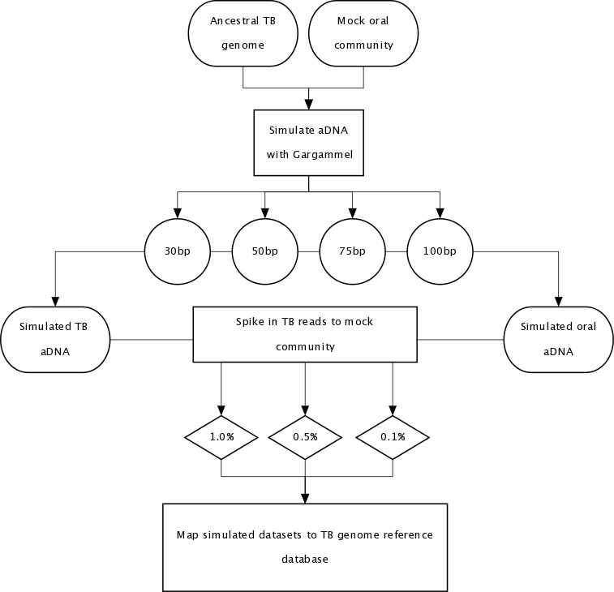

## terry_tb_sim

This repository details mock community simulation analyses performed in Austin *et al.* 2024. Metagenomic and paleopathological analyses of a historic documented collection expore ancient dental calculus as a diagnostic tool. Scientific Reports

[](https://zenodo.org/badge/latestdoi/286825746)



## Setup

This repository assumes you are running in a Unix environment (e.g., Mac OSX or Linux) and you have [conda](https://docs.conda.io/projects/conda/en/latest/user-guide/install/) installed.

To get this repository:

```bash
git clone https://github.com/aemann01/terry_tb_sim.git && cd terry_tb_sim
```

Then create and load the conda environment

```bash
conda env create -f environment.yml
conda activate terry_tb_sim
```

To deactivate the environment

```bash
conda deactivate
```
